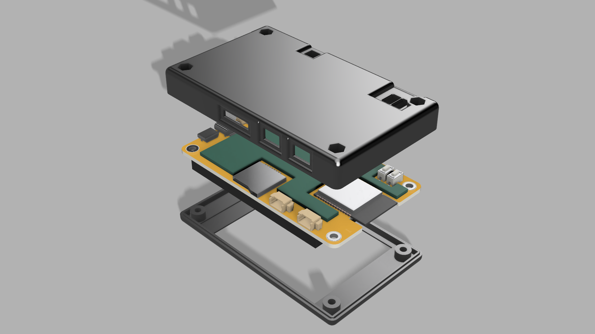
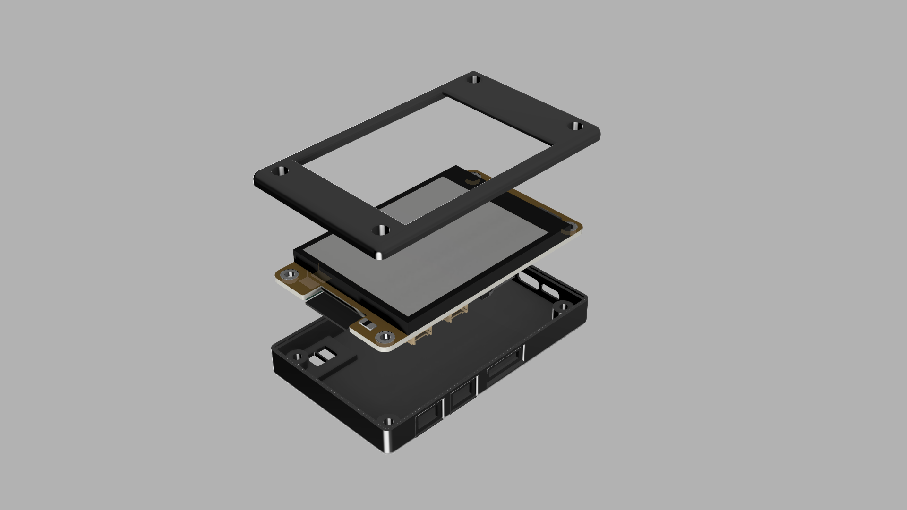

# custom case for esp32 yellow board ESP32 (2432S028R)

# overview
### this project is a custom case for esp32 yellow board (ESP32-2432S028R)
### repository contains 3D model of ESP32-2432S028R, and custom made case for this board which alows user to use full potential of the board

## picuture of bottom view

## picuture of top view

## files desription
1. esp_32_case_1.3fd - fusion 360 native file only with case
2. esp_32_board.3fd - fusion 360 native file only with board
3. esp32_board.step - step file of board (ready to print)
4. esp32_case_bottom.step - step file of bottom part of the case (ready to print)
5. esp32_case_top.stpe - step file of bottom part of the case (ready to print)

## issues
### project organisation:
1. there is no possibility to export file where everything is assembled, due to my mistake (I deleted connection between imported file and source file), i will fix it in meanwhile

### mechanical:
1. so far there is no bolts and screws in the 3d models. (you can try to try these which you already have, propably you will neeed to short them)

## Future updates
1. bolts and screws will be added

2. issues with project organisation will be resolved
